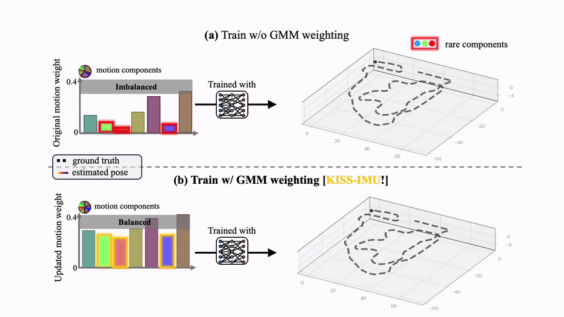

<div align="center">
  <h1>
    KISS-IMU: Self-supervised Inertial Odometry <br>
    with Motion-balanced Learning and Uncertainty-aware Inference
  </h1>
  <a href="https://github.com/sparolab"></a>
  <a href="https://sparolab.github.io/research/kiss_imu/"></a>
  <a href="https://arxiv.org/abs/2603.06205"></a>
  <a href="https://www.youtube.com/watch?v=cjAFROi-jG0"></a>
  <br />

  <h3>🏆 IEEE ICRA 2026 Award Finalist</h3>

  <a href="https://scholar.google.com/citations?user=wL8VdUMAAAAJ&hl=ko" target="_blank">Jiwon Choi</a>,
  <a href="https://hogyun2.github.io" target="_blank">Hogyun Kim</a>,
  <a href="https://scholar.google.com/citations?user=kiBTkqMAAAAJ&hl=ko" target="_blank">Geonmo Yang</a>,
  <a href="https://scholar.google.com/citations?user=kiBTkqMAAAAJ&hl=ko" target="_blank">Juhui Lee</a>,
  <a href="https://scholar.google.com/citations?user=W5MOKWIAAAAJ&hl=ko" target="_blank">Younggun Cho</a><sup>†</sup>

  **[🤖 Spatial AI and Robotics Lab (SPARO)](https://sites.google.com/view/sparo/%ED%99%88?authuser=0&pli=1)**

  <p align="center"></p>

  ***\<Keep IMU Stable and Strong\>***
</div>

---

## 📰 News
- 🏆 **May 6, 2026.** Selected as an **IEEE ICRA 2026 Award Finalist**.
- 🎉 **Jan 31, 2026.** Accepted to **IEEE ICRA 2026**.

## 💡 Overview
KISS-IMU denoises raw IMU streams against a self-generated LiDAR-odometry pseudo-label. A GMM-based motion-balanced sampler with a frequency gate keeps under-represented motion regimes from being drowned out during training.

## 🚀 Getting Started

### 🐳 Docker (recommended)

The image `sparolab/kiss-imu:v1.0` ships with all runtime dependencies (CUDA, PyTorch, pypose, kiss-icp, small_gicp, pygicp, scikit-learn).

```bash
git clone https://github.com/sparolab/KISS-IMU.git
cd KISS-IMU
```

Edit `docker/docker-compose.yml` and replace `{dataset_folder}` under `volumes:` with the absolute path to your datasets (e.g. `/mnt/hdd/datasets:/storage1`). Then launch:

```bash
docker compose -f docker/docker-compose.yml up -d
docker exec -it kiss-imu-ws bash
```

Inside the container, `pwd` is already `/home/test_ws/src`:

```bash
bash scripts/train.sh
```

### 🛠️ Native

```bash
pip install -r requirements.txt
bash scripts/train.sh
```

## 📂 Dataset Layout

One top-level `data_root` with one sub-directory per sequence:

```
📁 <data_root>/
└── 📂 <SEQUENCE_NAME>/
    ├── 📄 imu.csv
    ├── 📄 gt_pose.csv
    └── 📂 points/
        ├── 📂 data/
        │   ├── 🟦 000000.bin
        │   └── ...
        └── 📄 timestamps.txt
```

The loader handles dataset-specific column indices and coordinate transforms once `--data-type` is set (`kitti`, `mulran`, `diter_os`, …). See [examples/dataset_layout.md](examples/dataset_layout.md) for custom formats.

## 🏋️ Training

```bash
bash scripts/train.sh
```

Hyperparameters live as env vars at the top of [`scripts/train.sh`](scripts/train.sh):

| Variable        | Notes |
| --------------- | ----- |
| `DATA_DIR`      | Root directory of your dataset |
| `DATA_TYPE`     | `diter_os` \| `kitti` \| `mulran` \| ... |
| `TRAIN_SEQS` / `VALID_SEQS` | Sequence names under `DATA_DIR` |
| `LO_MODEL`      | `kiss_icp` \| `fast_gicp` \| `small_gicp` |
| `GMM_COMP_NUM`  | `0` = auto-pick K via BIC, otherwise fixed K |
| `USE_GT`        | GT pose supervision (ablation only, no ICP/PGO) |
| `USE_SUBMAP`    | Aggregate scans into a sub-map for ICP |
| `TRAIN_RATIO`   | Fraction of training windows used |

### Ablations

- **GT supervision.** Lets you isolate the GMM reweighting contribution from the LO pseudo-label.

  ```bash
  USE_GT=true bash scripts/train.sh
  ```

- **Raw-IMU + PVGO.** Reproduces the `Baseline*` reported in the paper.

  ```bash
  bash scripts/raw_pvgo.sh
  ```

## 📊 Evaluation

Evaluate the best checkpoint:

```bash
CKPT=results/.../best_model.ckpt \
  EVAL_SEQS="Forest_new Lawn_lower_night Park_in_day" \
  bash scripts/evaluate.sh
```

Reports per-window endpoint RPE (translation, rotation) and end-point
APE, averaged per sequence. Run `bash scripts/evaluate.sh --help` for
all options.

## 🛰️ Inference

Save full ICP / PGO trajectories as `.npz` + top-down `.png` for plotting or downstream stages:

```bash
CKPT=results/.../best_model.ckpt \
  SEQS="Forest_new Park_in_day" \
  bash scripts/inference.sh
```

| Variable               | Notes |
| ---------------------- | ----- |
| `CKPT`                 | Path to `best_model.ckpt` (required) |
| `SEQS`                 | Sequence names to run inference on (required) |
| `LO_MODEL`             | `kiss_icp` \| `fast_gicp` \| `small_gicp` |
| `USE_ADAPTIVE_WEIGHT`  | Weight ICP factors by overlap, IMU by integrated cov |
| `USE_SUBMAP`           | Aggregate scans into a sub-map for small_gicp |

Outputs land in `<ckpt-dir>/inference/<seq>/{inference.npz, trajectory.png}`.

## 🔬 Encoder t-SNE

Project encoder features to 2D and color by component id to verify motion-regime separation:

```bash
CKPT=results/.../best_model.ckpt \
  TRAIN_SEQS="Forest_new" EVAL_SEQS="Park_in_day" \
  bash scripts/tsne_encoder.sh
```

| Variable        | Notes |
| --------------- | ----- |
| `CKPT`          | Path to `best_model.ckpt` (required) |
| `GMM`           | Override the fitted GMM (defaults to `<ckpt-dir>/gmm.joblib`) |
| `TRAIN_SEQS` / `EVAL_SEQS` | One t-SNE plot per split |
| `PAIR_MODE`     | `all` plots every component. `farthest` keeps only the two components whose GMM means are most separated (focused separability check). |
| `PER_COMP`      | Points per component (`0` = auto, capped by `MAX_WINDOWS`) |
| `MAX_WINDOWS`   | Total cap on plotted points |
| `MIN_PER_COMP`  | Drop components with fewer windows than this |
| `PERPLEXITY`    | Auto-clamped down if needed |

Outputs: `<ckpt-dir>/tsne/{tsne_train.png, tsne_eval.png}`. The fitted GMM is saved alongside `best_model.ckpt` during training, so the default path usually just works.

## 🔗 Resources
- 📄 [arXiv](https://arxiv.org/abs/2603.06205)
- 🌐 [Project page](https://sparolab.github.io/research/kiss_imu/)
- 🎬 [Video](https://www.youtube.com/watch?v=cjAFROi-jG0)

## 📝 Citation
```bibtex
@inproceedings{choi2026kissimu,
  title     = {KISS-IMU: Self-supervised Inertial Odometry with
               Motion-balanced Learning and Uncertainty-aware Inference},
  author    = {Choi, Jiwon and Kim, Hogyun and Yang, Geonmo and Lee, Juhui and Cho, Younggun},
  booktitle = {IEEE International Conference on Robotics and Automation (ICRA)},
  year      = {2026}
}
```

## 📬 Contact
Jiwon Choi: jiwon2@inha.edu

## 📜 License
BSD 3.0 for academic use. For commercial use, please contact the authors.

## ✨ Contributors
<a href="https://github.com/sparolab/KISS-IMU/graphs/contributors">
  
</a>